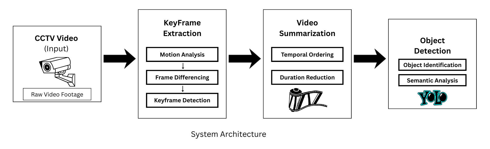
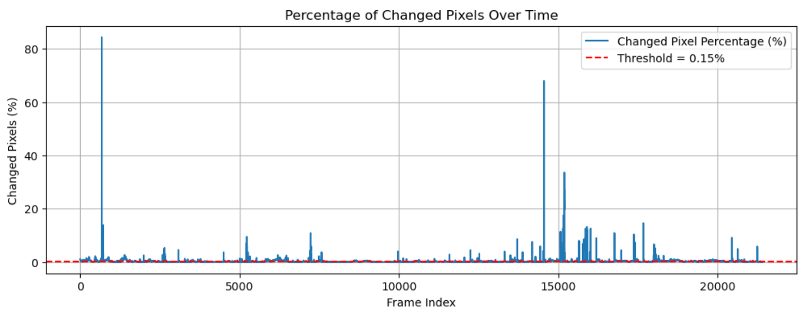
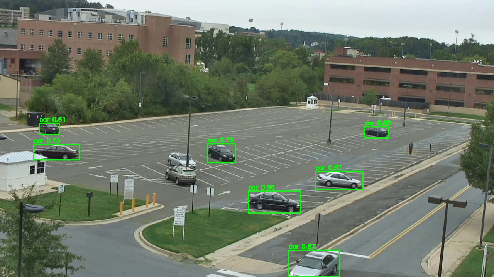

# CCTV Footage Summarization System

A modular and scalable system for automatic CCTV video summarization using motion-based frame selection, object detection, and video summarization.
The system eliminates redundant footage and efficiently highlights important events.

## Problem Statement

**Long-duration CCTV videos are difficult to analyze manually due to:**

- High redundancy

- Large storage requirements

- Limited actionable events

**This project addresses these challenges by:**

- Selecting only motion-relevant frames

- Applying object detection selectively

- Generating concise summary videos

## System Overview

**The pipeline consists of three independent modules, orchestrated by a master controller:**

- Frame Selection – Motion-based keyframe extraction

- Object Detection – YOLO-based detection on selected frames

- Summarization – Frame-to-video summary generation

Each module is reusable, independent, and scalable.

## Project Architecture


## Folder Structure
```
project/
│
├── Videos/
│   └── {video-name}.mp4
│
├── results/
│   └── {video-name}/
│       ├── selected_frames/
│       ├── detected_frames/
│       ├── summaries/
│       └── logs/
│
├── frame_preprocessing.py
├── frame_selection.py
├── object_detection.py
├── summarizer.py
├── main.py
└── README.md
```

## Processing Pipeline

- Input CCTV video
- Motion-based frame differencing
- Keyframe extraction
- Optional object detection on keyframes
- Summary video generation (raw & detected)

## Technologies Used
- Python
- OpenCV
- NumPy
- Ultralytics YOLOv8
- Matplotlib (for analysis/graphs)


## How to run

1. **Install dependencies**
```bash
  pip install opencv-python ultralytics numpy matplotlib
```
2. **Place Input Video**
```bash
  Videos/{video-name}.mp4
```
3. **Run main.py**
```bash
  python main.py
```
*All outputs will be stored automatically inside:*
```bash
  results/{video-name}/
```
*Output Structure (Per Video)*
```bash
results/{video-name}/
├── selected_frames/     # Motion-based keyframes
├── detected_frames/     # YOLO annotated frames
├── summaries/
│   ├── summary_raw.mp4
│   └── summary_detected.mp4
└── logs/
```
## Results & Visualizations
**Motion Analysis Graph**

_Graph showing percentage of changed pixels over time: (observation for one video)_




**Object Detection Results**

_Annotated frames with bounding boxes:_



**Comparision**

_Comparison prior to and following application of the system: (observation for one video)_

| Aspect | Before application | After application |
| ----------- | ----------- | ----------- |
| Frames processed | 64231 | 12411|
| Video Duration | 35:42 | 17:14 |
| No. of keyframes selected | N/A | 12411 |
| Percentage of frames retained | N/A | 19.32% |
| Percentage of frames reduction | N/A | 80.68% |


## Experimental Settings

- Frame differencing threshold: 15
- Motion percentage threshold: 0.15%
- Summary FPS: 12
- YOLO model: YOLOv8-nano
- Detected classes: person, car

## Key Advantages

- Modular and reusable design
- Efficient processing of long CCTV footage
- Reduced storage and computation
- Suitable for real-time and offline analysis

## Conclusion

This project demonstrates an efficient and scalable approach to CCTV video summarization by combining classical computer vision techniques with deep learning–based object detection. The modular design ensures flexibility, maintainability, and ease of extension.


## Author

- Sonjyoti Rabha
- Project Type: Academic / Final Year Project
- Domain: Computer Vision, Video Analytics

## References

-  A. B. Deshmukh, V. N. Aher, V. More, R. S. Pol, A. Talele, and A. Ingle, "Memory Efficient Summarization of Real-Time CCTV Surveillance System"
- Muhammad, K., Hussain, T., & Baik, S. W. "Efficient CNN based summarization of surveillance videos for resource-constrained devices". Intelligent Media Laboratory, Digital Contents Research Institute, Sejong University, Seoul-143-747, Republic of Korea, August 2018.
- L. Goel, "CCTV Footage Summarization for Increasing Efficiency in Surveillance (using ML)", International Journal of Innovative Science and Research Technology

- Ultralytics, ”YOLOv8: A State-of-the-Art Object Detection Model,” 2023. [Online]. Available: https://docs.ultralytics.com/

